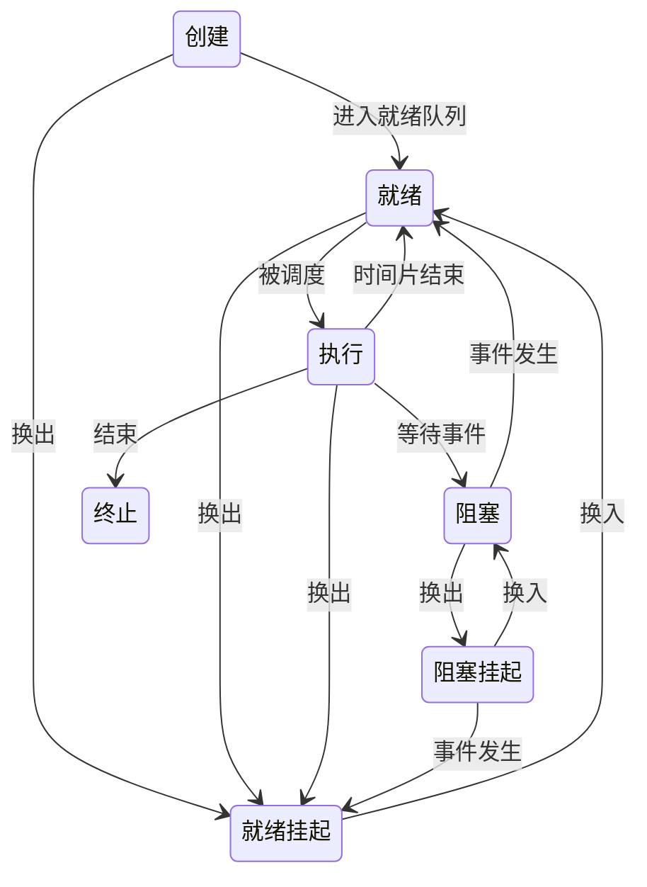

# 进程和线程

## 进程

### 定义

一个具有一定独立功能的程序在一个数据集合上的一次动态执行过程。

### 组成

一个进程包括了正在运行的一个程序的所有状态信息：

- 程序的代码
- 程序处理的数据
- 程序计数器中的值：指向下一条将要运行的指令
- 一组通用的寄存器的当前值、堆、栈
- 一组系统资源（如打开的文件等）

### 特点

- 动态性：可动态地创建、切换、结束进程
- 并发性：进程可以被独立调度并占用处理运行
- 独立性：不同进程的工作（正确性）不相互影响
- 制约性：因访问共享数据/资源或进程间同步而产生制约

### 生命周期

#### 基本状态

- 创建：系统已分配 PCB，但进程所需资源尚未获得，进程还未进入主存，不能被调度
- 就绪：进程已获得除 CPU 外的所有资源，一旦得到 CPU 即可运行
- 执行：进程已获得 CPU，程序正在执行
- 阻塞：正在执行的进程由于等待某一事件（如等待资源、输入/输出等）而暂停运行
- 终止：进程结束或因意外而被终止，此时进程不能再执行，但操作系统仍然保留着一个记录，包括状态码和计时等统计数据，供其他进程收集
- 挂起：进程被从内存转移到外存。处于此状态的进程在磁盘上，不占用内存空间
  - 阻塞挂起：进程在外存并等待某个事件
  - 就绪挂起：进程在外存，只要被装入内存即可运行

#### 状态变化模型

## 线程

### 定义

进程中的一条执行流程。

线程 = 进程 - 共享资源

### 组成

线程有独立的线程控制块 (TCB)，包括：

- 程序计数器 (PC)
- 堆栈 (SP)
- State
- 寄存器

以及属于同一个进程的多个线程所共享的资源，如代码、数据和打开的文件等

### 特点

- 一个进程可以同时拥有多个线程
- 多个线程可以并发地执行
- 同一个进程的多个线程之间可以共享地址空间和文件等资源
- 一个线程崩溃，通常会导致其所属进程的所有线程崩溃

### 实现

#### 用户线程

在用户空间实现的线程机制（操作系统不可见，由用户线程库管理）。

- 不依赖操作系统的内核，由一组用户级的线程库函数完成线程的管理，如创建、终止、同步等
- 可用于不支持线程技术的多进程操作系统
- 每个进程都需要自己私有的 TCB 列表，用于跟踪记录各个线程的状态，TCB 由线程库函数来维护
- 用户线程的切换也是由线程库函数来完成，无需[用户态/内核态](#用户态和内核态)的切换，速度快
- 允许每个进程拥有自定义的线程调度算法
- 如果一个线程因发起[系统调用](#系统调用)而阻塞，则整个进程等待；一个线程开始运行后，除非主动交出 CPU 使用权，否则其所在进程中的其他线程无法运行；多线程执行时，每个线程分到的时间片较少、执行较慢

#### 内核线程

在操作系统内核中实现的线程机制，由操作系统来完成线程的管理。

- 在支持内核线程的操作系统中，由内核维护进城和线程的上下文信息（PCB 和 TCB）
- 线程的创建、终止和切换等都是通过系统调用的方式进行，由内核完成，系统开销大
- 一个进程中，如果某个内核线程因发起系统调用而被阻塞，不会影响其他内核线程的运行
- 时间片分配给线程，多线程的进程获取更多的 CPU 时间

#### 轻量线程

在内核中实现，支持用户线程。

- 内核支持的用户线程
- 一个进程可有一个或多个轻量进程，每个轻量级进程由一个单独的内核线程来支持

## 进程和线程的比较

- 进程是资源分配的单位；线程是 CPU 调度的单位
- 进程拥有一个完整的资源平台；线程只独享必不可少的资源，如寄存器和堆栈
- 进程和线程有相同的基本状态和状态变化模型
- 线程并发执行的时间和空间开销比进程小，同一进程内线程切换时间比进程短（无需切换页表）
- 同一进程的各个线程可以不通过内核直接通信（共享内存）
