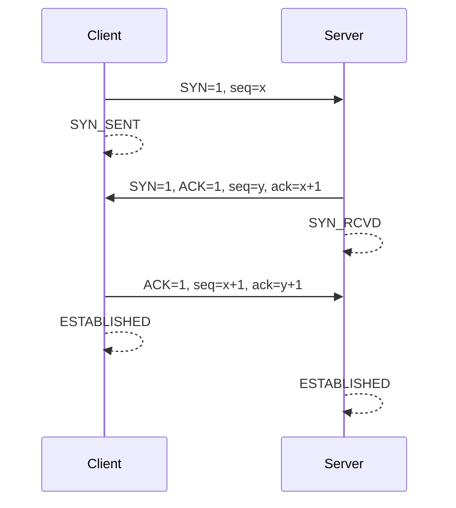
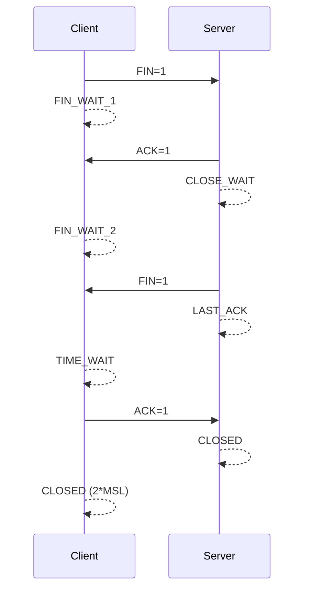

# TCP

## 特点

- 面向连接的协议
- 可靠、有序
- 面向字节流
- 速度较慢
- 全双工
- 适用于文件传输、浏览器等

## 三次握手建立连接

### 目的

- 保证数据的可靠传输，同时提高传输效率
- 防止已经失效的连接请求报文段又传送到了服务端
- 解决网络中存在延迟的重复分组问题

### 过程

1. Client 向 Server 发送含有同步序列号的标识位数据段，请求建立链接：`SYN=1, seq=x`，进入 SYN_SENT 状态
2. Server 收到请求后发送含有确认应答、同步序列号和标识位的数据段：`SYN=1, ACK=1, seq=y, ack=x+1`，进入 SYN_RCVD 状态
3. Client 收到后发送确认应答：`ACK=1, seq=x+1, ack=y+1`，进入 ESTABLISHED 状态；Server 收到应答后也进入 ESTABLISHED 状态，连接建立

## 四次挥手断开连接

### 目的

全双工通信：一方关闭连接，另一方等待数据传输完毕后再关闭（半关连接）

### 过程

> 注意：这里的 Client 表示主动关闭连接的一方，Server 表示被动关闭的一方

1. Client 完成数据传输后，`FIN` 位置 1，请求停止连接，进入 FIN_WAIT_1 状态
2. Server 收到 `FIN` 后做出响应，将 `ACK` 置 1，进入 CLOSE_WAIT 状态；Client 收到应答后进入 FIN_WAIT_2 状态
3. Server 再次发送关闭请求，`FIN` 位置 1，进入 LASK_ACK 状态
4. Client 收到请求后进入 TIME_WAIT 状态，并对 Server 的请求进行确认，将 `ACK` 置 1，等待 2 倍最长报文段寿命 (MSL) 时间后进入 CLOSED 状态；Server 收到应答后进入 CLOSED 状态，连接断开

### TIME_WAIT 状态为什么等待 2\*MSL

- 确保客户端发送的最后一个 ACK 报文能够到达服务器
- 使本连接持续时间内所产生的所有报文段都从网络中消失，防止已经失效的报文出现在下一个新的连接中

## 流量控制

## 拥塞控制
