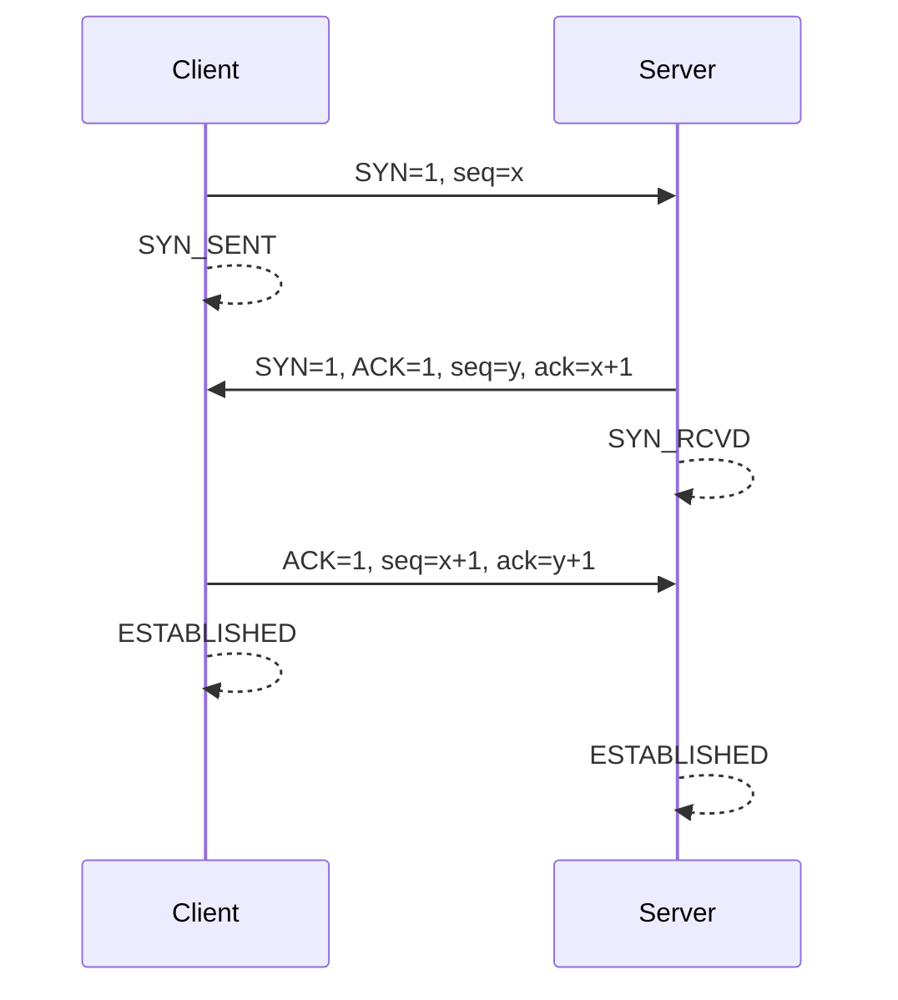
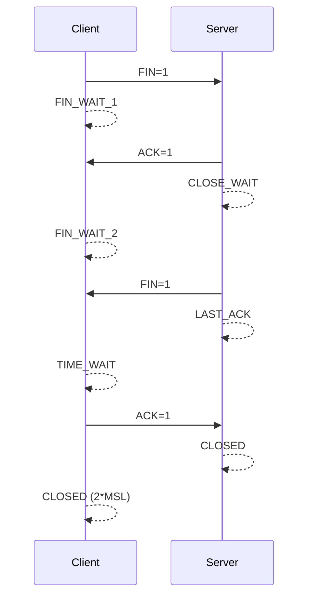

## 特点

- 面向连接的协议
- 可靠、有序
- 面向字节流
- 速度较慢
- 全双工
- 适用于文件传输、浏览器等

## 三次握手建立连接

### 目的

- 保证数据的可靠传输，同时提高传输效率
- 防止已经失效的连接请求报文段又传送到了服务端
- 解决网络中存在延迟的重复分组问题

### 过程

1. Client 向 Server 发送含有同步序列号的标识位数据段，请求建立连接：`SYN=1, seq=x`，进入 SYN_SENT 状态
2. Server 收到请求后发送含有确认应答、同步序列号和标识位的数据段：`SYN=1, ACK=1, seq=y, ack=x+1`，进入 SYN_RCVD 状态
3. Client 收到后发送确认应答：`ACK=1, seq=x+1, ack=y+1`，进入 ESTABLISHED 状态；Server 收到应答后也进入 ESTABLISHED 状态，连接建立

## 四次挥手断开连接

### 目的

全双工通信：一方关闭连接，另一方等待数据传输完毕后再关闭（半关连接）。

### 过程

> 注意：这里的 Client 表示主动关闭连接的一方，Server 表示被动关闭的一方

1. Client 完成数据传输后，`FIN` 位置 1，请求停止连接，进入 FIN_WAIT_1 状态
2. Server 收到 `FIN` 后做出响应，将 `ACK` 置 1，进入 CLOSE_WAIT 状态；Client 收到应答后进入 FIN_WAIT_2 状态
3. Server 再次发送关闭请求，`FIN` 位置 1，进入 LASK_ACK 状态
4. Client 收到请求后进入 TIME_WAIT 状态，并对 Server 的请求进行确认，将 `ACK` 置 1，等待 2 倍最长报文段寿命 (MSL) 时间后进入 CLOSED 状态；Server 收到应答后进入 CLOSED 状态，连接断开

### TIME_WAIT 状态为什么等待 2\*MSL

- 确保客户端发送的最后一个 ACK 报文能够到达服务器
- 使本连接持续时间内所产生的所有报文段都从网络中消失，防止已经失效的报文出现在下一个新的连接中

## 流量控制

作用于**接收者**，控制发送者的发送速度从而使接收者来得及接收，防止分组丢失，是点对点通信量的控制。

### 实现

#### 滑动窗口

- 发送窗口：发送方维持的一个连续的允许发送的帧的序号
- 接受窗口：接收方维持的一个连续的允许接收的帧的序号

发送窗口和接收窗口的序号的上下界不一定要一样，甚至大小也可以不同

#### 1 比特滑动窗口协议

- 发送窗口和接收窗口的大小固定为 1（退化为停等协议）
- 发送方每发送一帧后就停下来，等待接收方已正确接收的确认 (ack) 返回后再继续发送下一帧
- 接收方需要判断接收到的帧是新发的帧还是重新发送的帧，因此发送方要为每一个帧加一个序号

#### 后退 n 协议

- 发送方在发完一个数据帧后，不停下来等待应答帧，而是连续发送若干个数据帧
- 即使在连续发送过程中收到了接收方发来的应答帧，也可以继续发送
- 发送方在每发送完一个数据帧时都要设置超时定时器，只要在所设置的超时时间内仍未收到确认帧，就要重发相应的数据帧及后序数据帧

#### 选择重传协议

- 当接收方发现某帧出错后，其后继续送来的正确的帧虽然不能立即递交给接收方的上层，但接收方仍可收下来，存放在一个缓冲区中，同时要求发送方重新传送出错的那一帧
- 一旦收到重新传来的帧后，就可以原已存于缓冲区中的其余帧一并按正确的顺序递交上层

## 拥塞控制

作用于**网络**，防止过多的数据注入到网络中，避免出现网络负载过大的情况，是全局性的过程。

拥塞：在某段时间内，对网络中某一资源的需求超过了该资源所能提供的可用部分，网络的性能变差。

### 实现

#### 慢开始

不要一开始就发送大量的数据，先探测一下网络的拥塞程度，也就是说由小到大逐渐增加拥塞窗口的大小。

- 发送方维持一个拥塞窗口 (cwnd)，其大小取决于网络的拥塞程度并动态变化
- 初始时拥塞窗口大小为 1，由小到大逐渐增加拥塞窗口的大小
- 发送方收到确认后倍增拥塞窗口大小
- 当拥塞窗口大于阈值（慢开始门限：出现拥塞时拥塞窗口大小的一半）时，改为[拥塞避免](#拥塞避免)算法，避免引起网络拥塞

#### 拥塞避免

缓慢增加拥塞窗口大小，每经过一个往返时间 (RTT) 就把发送方的拥塞窗口加 1。如果出现拥塞（没有收到确认），就把慢开始门限设置为此时拥塞窗口的一半，并把拥塞窗口的大小设为 1，执行[慢开始](#慢开始)算法。

#### 快重传

快重传要求接收方在收到一个失序的报文段后就立即发出重复确认。发送方只要一连收到三个重复确认就应当立即重传对方尚未收到的报文段，而不必继续等待设置的重传计时器时间到期。

#### 快恢复

配合[快重传](#快重传)算法使用，当发送方连续收到三个重复确认时，执行乘法减小算法，把慢开始门限减半，同时将拥塞窗口设置为慢开始阈值大小，然后执行[拥塞避免](#拥塞避免)算法。
