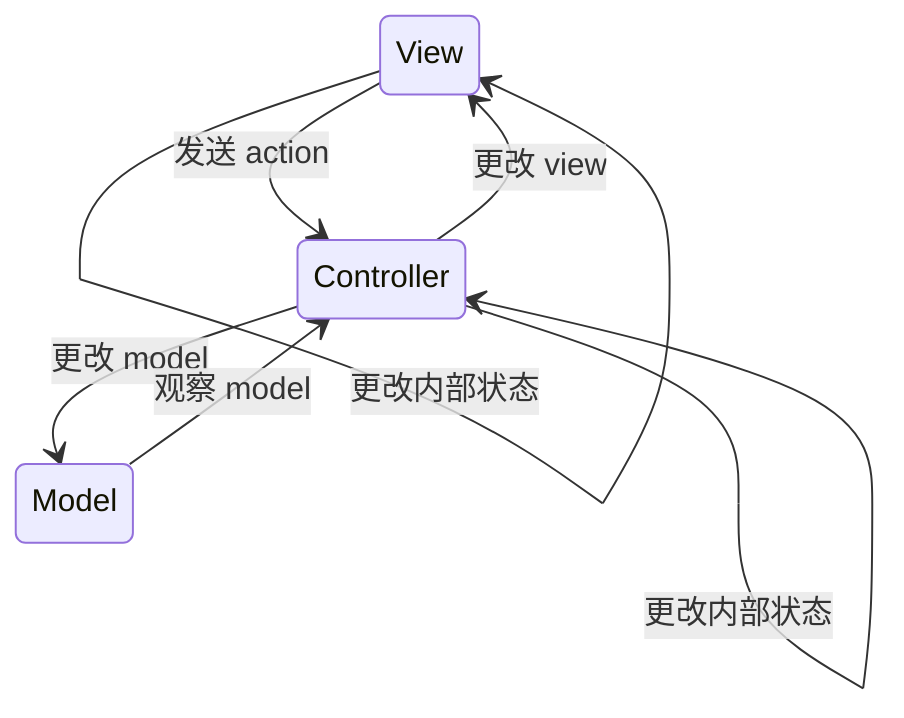

```mermaid
stateDiagram-v2
View --> View: 更改内部状态
View --> Controller: 发送 action
Controller --> Controller: 更改内部状态
Controller --> Model: 更改 model
Controller --> View: 更改 view
Model --> Controller: 观察 model
```
